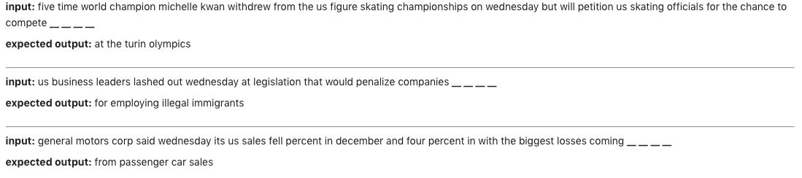

# 
 Neural network LMs for ASR 

**Course**: `ELEC-E5551` Speech Recognition

**[Literature review](https://docs.google.com/document/d/1KlBNfJWY0pv8c1Q6QQlK82AepUpb-hZYQHmQXQckLF0/edit)**

**[Project plan](https://docs.google.com/document/d/1pQ9311POMwUWQ9c4YOJZzl8wROE7AqnUl2_4XWKCfxQ/edit)**

**Dataset**: [English Gigaword Corpus](https://catalog.ldc.upenn.edu/LDC2003T05)

***Experiments**: Uses RNNs and availability to run using FFNN  

----

**[Exploratory data analysis](exploratory_data_analysis.ipynb)**, 4 sections:
1. Data load, Preprocessing, Basic details
2. Word clouds, common words
3. Bigrams, Trigrams, Collocations
4. Splitting data into model input, expected output

----

**Baseline statistics:**